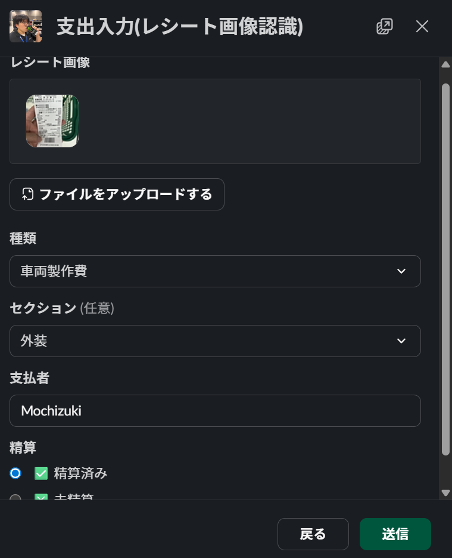
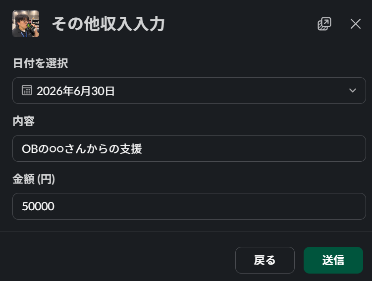
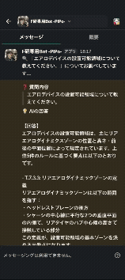
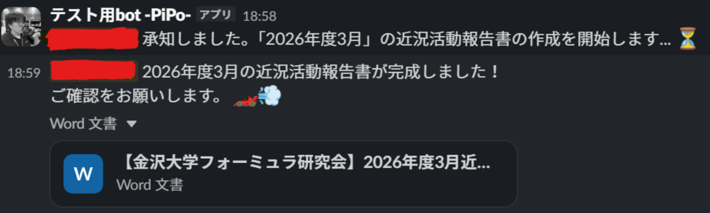
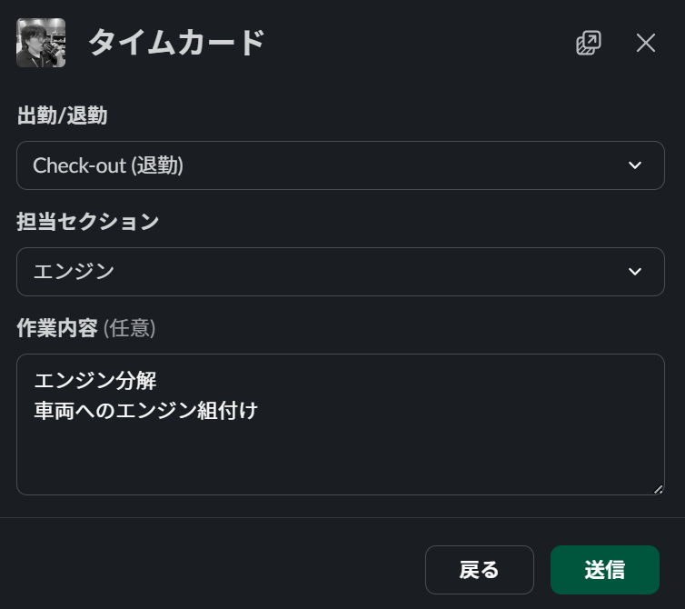

# kf-slack-application

学生フォーミュラチームの業務効率化・組織運営の課題解決を目的とした、AI搭載型Slack Botである。
スマートフォンやPCからシームレスに利用できるSlackをUI（ユーザーインターフェース）に採用し、チームのメイン活動の律速要因となりうる事務業務を自動化・効率化した。

---

## 📌 プロジェクトの背景と目的

学生フォーミュラの活動では、メインである車両の設計・製作以外に、膨大な事務作業やチーム運営の課題が存在する。これらがボトルネックとなり、開発スケジュールの遅延を引き起こす組織課題となっていた。
本プロジェクトは、2022年5月からチームに在籍してきた開発者が、**「現役引退後も、後輩たちがメイン活動に注力できる環境を作る」というミッションを掲げて**始動させた。

---

## 🚀 主要機能

※`/○○`は機能を呼び出すためのSlackコマンドである

### 1. 会計管理システム (`/accounting`)

この機能はSlack上の入力フォームから収支情報をスプレッドシートに入力できる機能である。

従来はPCからNAS上のExcelファイルにVPN接続でアクセスし手入力していたが、この機能によりいつでもどこでもスマートフォンから迅速かつ容易な入力が可能になった。

* **レシート・明細の自動画像認識入力 :** OpenAIの画像認識モデルなどを活用し、添付された領収書（PNG/JPG/PDF）から支出情報を自動抽出する。

  * 抽出データは自動で管理用スプレッドシートに書き込まれる。コマンドのほか、メッセージショートカットからもシームレスに実行可能である。

  

* **部費・収支管理機能:** 手動での支出入力や、OBからの寄付等の収入入力、部員の部費支払い状況照会に対応する。

  

### 2. 定例ミーティング議事録の自動要約 (`/meeting-summary`)

* **Firestore連携によるLLM要約:** Google Cloud Firestoreに保存された定例ミーティングの文字起こしデータを参照する。
  * OpenAIのLLMを用いて、欠席者向けに最適化された議事録の要約を自動生成し、該当のSlackチャンネルへ送信する。

### 3. レギュレーション検索システム (RAG) (`/rag` または Botへメンション)

* **非公開質問 (`/rag` コマンド):** チャンネルの他のメンバーに見られず、個人でレギュレーションの確認が可能である。質問後にBotからメッセージが送られてくる。

* **公開質問 (メンション):** チャンネル全体に質問と回答が共有され、知見の横展開を促進する。スレッド内での文脈を維持した対話型AIチャットもサポートしている。

### 4. 近況活動報告書の作成支援・自動化 (`/activity-report`)

* **定期リマインド:** 毎月の原稿提出締め切り（25日）に合わせ、15日と20日に担当者をメンションした原稿作成催促メッセージを送信する。
* **報告書一括生成 (`/activity-report`):** 提出された原稿と写真がGoogle Driveの指定フォルダにアップロードされた後、本コマンドを実行する。

  * 原稿や写真を報告書テンプレートに一括挿入し、提出用報告書を自動生成する。

  

### 5. チーム運営・アセット管理

* **共用PC予約システム:** チャンネル内の「PC利用宣言」メッセージに対し、別の部員が予約リアクション（スタンプ）を押すことで予約が完了する。現利用者が利用完了スタンプを押すと、予約者へ自動通知が飛ぶ仕様である。
* **タイムカード機能 (`/timecard`):** 「出退勤・担当セクション・作業内容」を入力し、スプレッドシートに送信する。チーム内の作業リソースや功労者の可視化を目的に、現在試運転中である。
  * 

---

## 🔧 環境変数 (Configuration)

アプリケーションの動作には、Cloud Runの環境変数として以下の設定が必要である。

### 1. 認証・APIキー

* `SLACK_BOT_TOKEN`: Slack Botのアクセストークン
* `SLACK_SIGNING_SECRET`: Slackからのリクエスト検証用シークレット
* `OPENAI_API_KEY`: OpenAI APIの利用キー

### 2. データ連携 (Google Workspace / Firebase)

* `ACCOUNTING_SHEET_ID`: 会計管理用スプレッドシートの個別ID
* `ACTIVITY_REPORT_SHEET_ID`: 活動報告管理用スプレッドシートの個別ID
* ※ Firebase/Firestoreの認証には、標準のGoogleアプリケーションデフォルト資格情報（ADC）またはサービスアカウントキーを使用する。

### 3. Slack チャンネル・ユーザー管理

* `RAG_CHANNEL_ID` / `ACCOUNTING_CHANNEL_ID` / `ACTIVITY_REPORT_CHANNEL` / `MEETING_CHANNEL_ID`: 各機能を作動させるSlackのチャンネルID
* `ACCOUNTING_USERS`: 会計機能の実行権限を付与する特定メンバーのユーザーID

### 4. 検索インデックス (RAG)

* `PINECONE_INDEX_NAME`: Pineconeに構築したインデックス名

---

## 🛠️ 技術スタック

クラウドインフラおよびデータ基盤には、コンポーネント間の親和性と運用の容易性を考慮し、**可能な限りGoogle関連サービス（Google Cloud / Google Spreadsheetなど）を採用してエコシステムを統一**している。
一方で、中核となるAI機能にはGoogleのモデルではなく**OpenAI APIを採用**した。これは自然言語処理、Audio to Text（音声文字起こし）、Image to Text（画像認識）など豊富なモーダリティに対応しており、ユースケースに応じて低コストモデルから高精度モデルまで柔軟に選択・検証できる優位性があったためである。(※開発初期当時)

| レイヤー                               | 技術・サービス                            | 採用理由 / 用途                                                                                                                |
| :------------------------------------- | :---------------------------------------- | :----------------------------------------------------------------------------------------------------------------------------- |
| **Language**                     | Python 3.12+                              | 豊富な外部ライブラリ（Slack SDK、OpenAI等）との迅速な連携のため。                                                              |
| **Infrastructure**               | Google Cloud Run                          | 部員のアクセスに応じた柔軟なスケーリングと、サーバーレスによる低コスト運用の両立。                                             |
| **Database / Text data**         | Google Cloud Firestore                    | ミーティングの文字起こしデータなどの柔軟な蓄積・管理。                                                                         |
| **Database / Member infomation** | Google Spreadsheet Google Sheets API | プログラミングが分からないチームメンバーでも一部機能(新年度へのメンバー情報更新など)であれば容易に手動編集できるデータ運用性。 |
| **AI**                           | OpenAI API                                | 多彩なAPI（テキスト・音声・画像）が揃っており、コストと精度のバランスに合わせたモデル選定・実験が容易であるため。              |
| **Vector DB**                    | Pinecone                                  | 膨大な大会レギュレーションのセマンティック検索（RAG）の実現。                                                                  |
| **Automation**                   | Google Cloud Scheduler                    | 月次の活動報告書リマインドなど、定期実行タスクの自動化。                                                                       |
